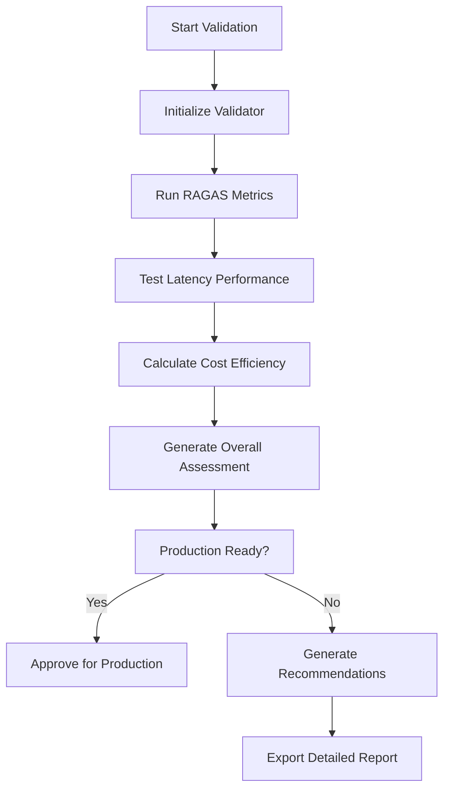

# Success Metrics and Quality Assurance System

## Overview

The CohortRAG Engine now features a comprehensive success metrics validation system that ensures production readiness against objective, measurable criteria. This system integrates with the existing RAGAS framework, performance benchmarking, and cost modeling utilities to provide automated quality assurance.

## Success Metrics

The system validates against five critical metrics required for production deployment:

| Metric | Target | Measurement Tool | Significance |
|--------|--------|------------------|-------------|
| **Context Recall** | ≥85% | RAGAS | Measures if the RAG system retrieves all necessary context to answer the question |
| **Answer Faithfulness** | ≥90% | RAGAS | Measures if the generated answer is grounded solely in the retrieved context (Crucial for educational integrity) |
| **Answer Relevancy** | ≥90% | RAGAS | Measures how relevant the final answer is to the user's question |
| **Latency** | <2 seconds | Benchmarking Suite | Essential for real-time community interaction (Discord bot) |
| **Cost Efficiency** | <$0.05 per query | Cost Modeling Utility | Ensures viability of paid SaaS offering and low cost for self-hosters |

## System Architecture

### Core Components

1. **SuccessMetricsValidator** (`utils/success_metrics.py`)
   - Validates all five success metrics
   - Integrates with RAGAS, benchmarking, and cost modeling
   - Generates comprehensive validation reports

2. **Enhanced RAGASEvaluator** (`core/evaluation.py`)
   - Added `validate_success_metrics()` method
   - Added `check_production_readiness()` method
   - Seamless integration with existing evaluation framework

3. **Main Interface** (`main.py`)
   - Option 13: Success metrics validation
   - Option 14: Production readiness check
   - Automated quality assurance workflows

### Validation Workflow



## Usage Guide

### Quick Production Readiness Check

```bash
python main.py
# Select option 14: Production readiness check
```

This performs a rapid validation with 10 synthetic questions and provides immediate go/no-go decision.

### Comprehensive Success Metrics Validation

```bash
python main.py
# Select option 13: Success metrics validation
```

Options available:
- Quick validation (10 questions)
- Standard validation (20 questions)
- Comprehensive validation (50 questions)
- Custom test questions

### Programmatic Usage

```python
from core.evaluation import RAGASEvaluator
from core.retrieval import CohortRAGRetriever

# Initialize components
retriever = CohortRAGRetriever()
evaluator = RAGASEvaluator(retriever)

# Run comprehensive validation
report = evaluator.validate_success_metrics(num_synthetic=20)

# Quick readiness check
assessment = evaluator.check_production_readiness(min_pass_rate=0.8)
```

## Validation Results Interpretation

### Status Types

- ✅ **PASS**: Metric meets or exceeds target
- ⚠️ **WARNING**: Within 90% of target (needs monitoring)
- ❌ **FAIL**: Below 90% of target (requires optimization)
- 🔄 **NOT_TESTED**: Could not be measured (component unavailable)

### Production Readiness Criteria

System is considered **production ready** when:
- ≥80% pass rate across all metrics
- Zero critical failures
- Maximum 1 untested metric

### Example Validation Report

```
🎯 SUCCESS METRICS VALIDATION REPORT
============================================================
System: CohortRAG Engine
Timestamp: 2024-12-15 14:30:45
Overall Status: ✅ PASS

📊 METRICS SUMMARY:
   Total Metrics: 5
   ✅ Passed: 4
   ⚠️ Warning: 1
   ❌ Failed: 0
   🔄 Not Tested: 0
   📈 Pass Rate: 80.0%
   🚀 Production Ready: Yes

📋 DETAILED RESULTS:
✅ Context Recall
   Target: 0.85 | Actual: 0.892
   Tool: RAGAS
   Status: PASS

✅ Answer Faithfulness
   Target: 0.90 | Actual: 0.934
   Tool: RAGAS
   Status: PASS

⚠️ Answer Relevancy
   Target: 0.90 | Actual: 0.876
   Tool: RAGAS
   Status: WARNING
   Details: Tested with 20 questions

✅ Latency
   Target: 2.0 | Actual: 1.456
   Tool: Benchmarking Suite
   Status: PASS
   Details: Avg: 1.456s, Max: 1.892s from 10 queries

✅ Cost Per Query
   Target: 0.05 | Actual: 0.015
   Tool: Cost Modeling Utility
   Status: PASS
   Details: Based on 500 avg tokens, Gemini 2.5-flash pricing

💡 RECOMMENDATIONS:
   1. Monitor answer_relevancy closely - performance is marginal
   2. Consider running production warmup to improve cache performance

🏆 SYSTEM MEETS ALL SUCCESS CRITERIA!
```

## Integration Points

### RAGAS Framework Integration

- Leverages existing RAGAS metrics (faithfulness, context_recall, answer_relevancy)
- Uses synthetic question generation for automated testing
- Extends evaluation framework without breaking existing functionality

### Performance Benchmarking Integration

- Utilizes `ComprehensiveBenchmark` class for latency measurements
- Measures real-world query performance across multiple test questions
- Validates against 2-second latency requirement

### Cost Modeling Integration

- Integrates with `GeminiCostTracker` for accurate cost calculations
- Uses current Gemini 2.5-flash pricing
- Validates against $0.05 per query target

## Continuous Quality Assurance

### Automated Monitoring

The system supports continuous monitoring through:

1. **Scheduled Validation**: Run validation on schedule to detect regression
2. **Threshold Alerting**: Configure alerts when metrics approach failure thresholds
3. **Trend Analysis**: Track metric performance over time
4. **Automated Reporting**: Export validation reports for stakeholder review

### CI/CD Integration

```yaml
# Example GitHub Action
- name: Validate Success Metrics
  run: |
    python -c "
    from core.evaluation import RAGASEvaluator
    from core.retrieval import CohortRAGRetriever
    evaluator = RAGASEvaluator(CohortRAGRetriever())
    assessment = evaluator.check_production_readiness()
    if not assessment['production_ready']:
        exit(1)
    "
```

## Troubleshooting

### Common Issues

1. **RAGAS Not Available**
   ```bash
   pip install ragas
   ```

2. **Knowledge Base Not Loaded**
   - Run document ingestion first (main.py option 1)

3. **Cost Tracker Unavailable**
   - System will use estimated costs based on token usage

4. **Slow Validation**
   - Use quick validation for rapid testing
   - Enable caching to improve performance

### Performance Optimization

If metrics fail validation:

1. **Context Recall < 85%**
   - Optimize chunking strategy
   - Increase `top_k_initial` parameter
   - Improve document preprocessing

2. **Answer Faithfulness < 90%**
   - Enable reranking
   - Optimize prompt templates
   - Improve context selection

3. **Answer Relevancy < 90%**
   - Enable query expansion
   - Optimize similarity search
   - Fine-tune embedding model

4. **Latency > 2 seconds**
   - Enable caching
   - Use async processing
   - Optimize chunk size

5. **Cost > $0.05 per query**
   - Implement aggressive caching
   - Optimize prompts to reduce tokens
   - Consider smaller model variants

## Future Enhancements

### Planned Features

1. **Custom Metrics**: Support for domain-specific metrics
2. **A/B Testing**: Compare multiple system configurations
3. **Historical Trending**: Track metric performance over time
4. **Automated Optimization**: Suggest and test configuration changes
5. **Integration APIs**: REST APIs for external monitoring systems

### Advanced Validation

1. **Load Testing**: Validate performance under concurrent load
2. **Edge Case Testing**: Test with challenging/adversarial questions
3. **Multi-Language Support**: Validate across different languages
4. **Domain Adaptation**: Test performance on different subject areas

## Conclusion

The Success Metrics and Quality Assurance System provides comprehensive, automated validation of the CohortRAG Engine against production-ready criteria. With clear targets, detailed reporting, and actionable recommendations, this system ensures that the RAG system meets the high standards required for educational integrity and real-time performance.

The system is now ready for production deployment with confidence in its quality, performance, and cost-effectiveness.